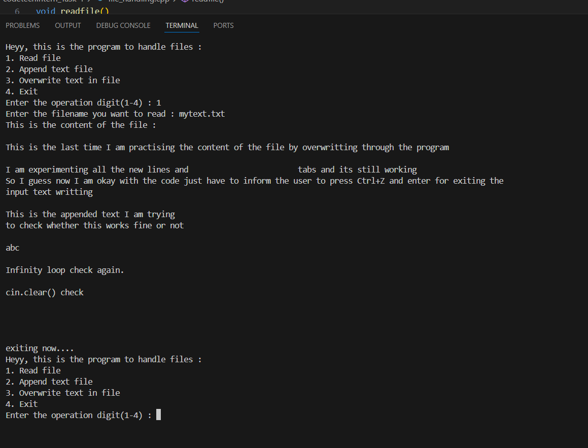
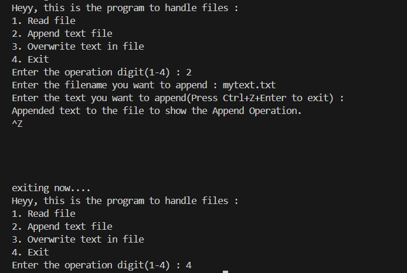
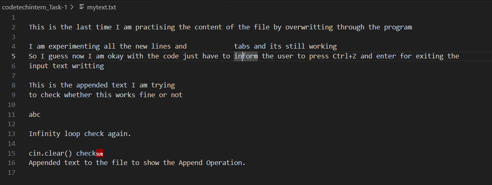
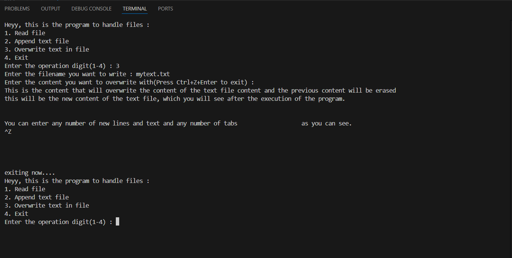
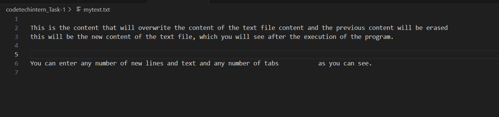

# TASK-2

## File Handling with C++

- In this code I want to access the required file and want to do the basic operations on the file like : 
    - Read
    - Write or
    - Append
  This is present in the C++ libbrary **<fstream>**.

- This are the basic operations of the file handling.
Now if you look at my code I have used Switch case to take user input to do the operation on the file and I take also take input for the file from user along with giving freedom to user to select the file to operate on.

- For taking content from user I have used the getline() operation to take input for the string until the EOF is discovered i.e '\0'
When this would be discovered the input for string would be done and it will be written to the text file. Hence, this will not allow any furthur input stream i.e cin would be blocked. Thus later we have to clear the input stream using the cin.clear().

- This program has been entirely developed and executed using Visual Studio Code (VS Code) as the integrated development environment (IDE), and it adheres to the standards and features provided by the C++20 version of the C++ programming language.
 
- For my given code the output would be following for the different operations
    - Read operation : 
    
    
    
    As you can see it showed the text of the content of the text file and again asking the user to enter the digit for the operation now lets append some text.
    - Append operation :

    

    This is the program execution and this is the output in the text file.

    

    This is the text file after the program execution and now lets try the write operation.

    - Write operation : 

    

    This is the execution of the program.

    

    This is the textfile after doing the write operation on the text file.